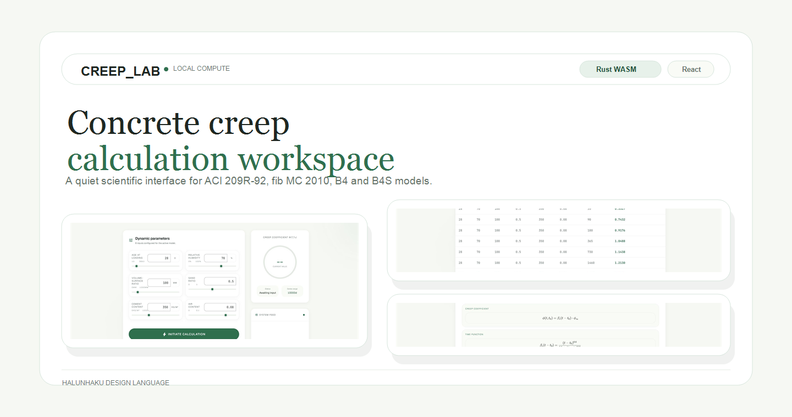
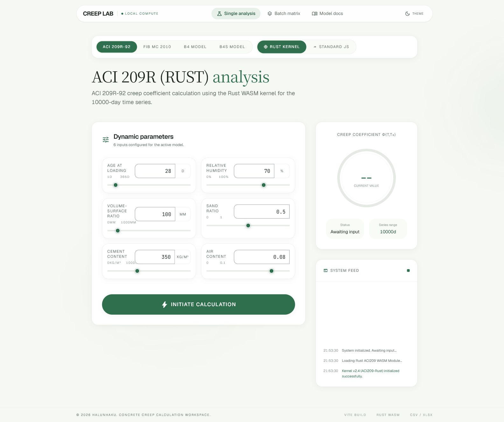
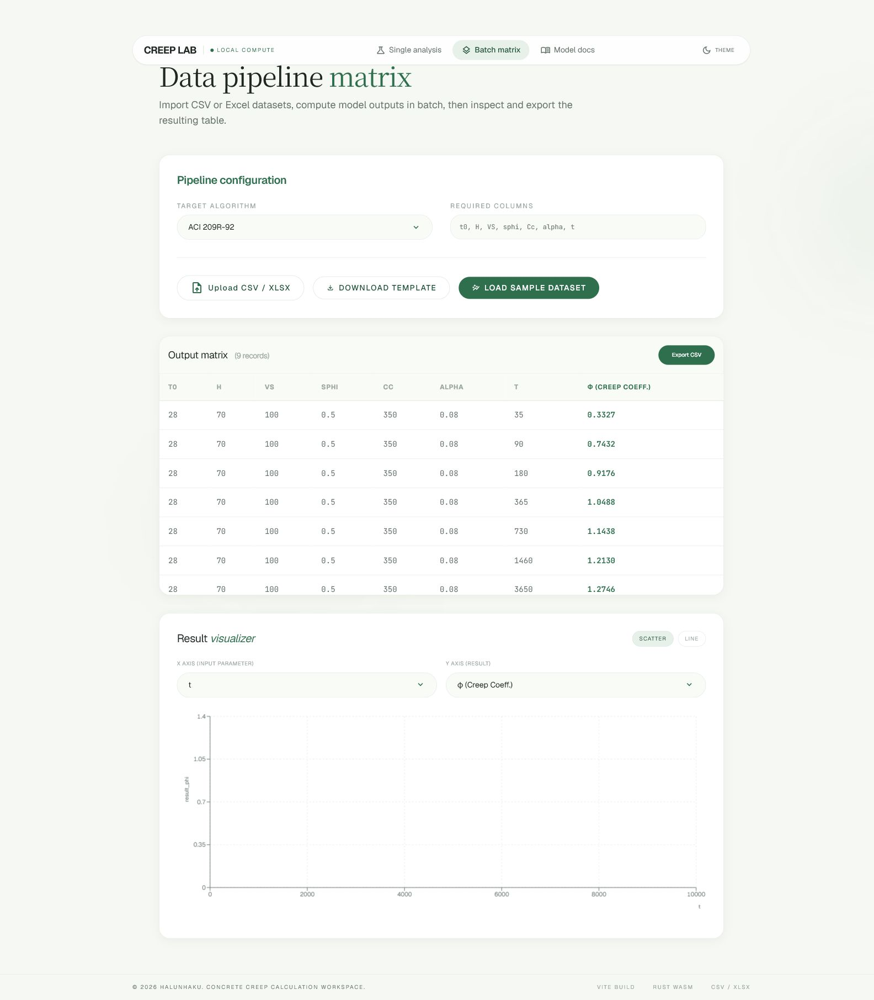
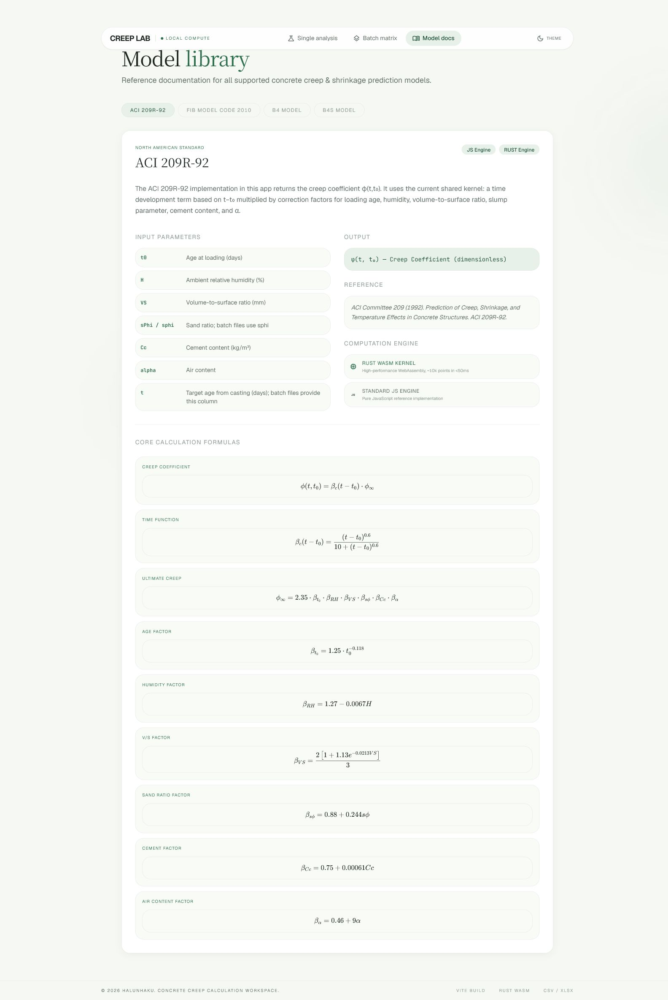
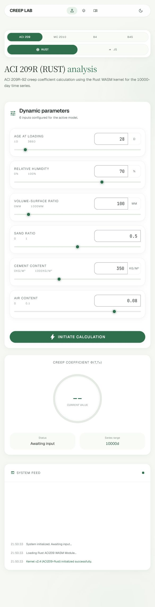
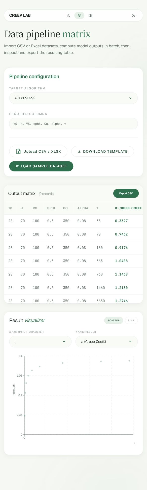
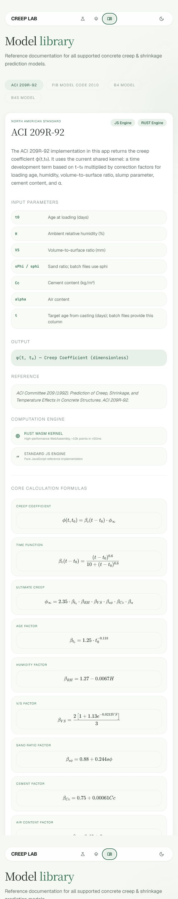
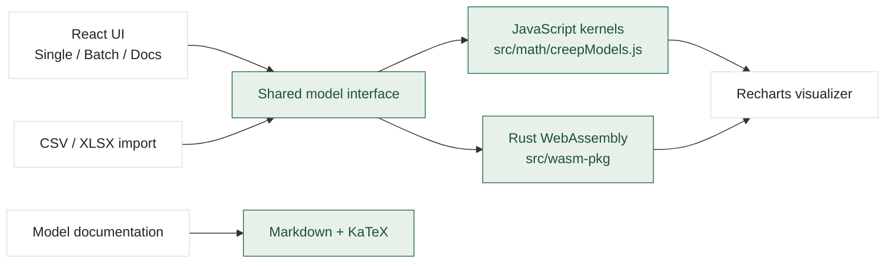

<p align="center">
  
</p>

<h1 align="center">CREEP_LAB</h1>

<p align="center">
  A quiet concrete creep and shrinkage calculation workspace with JavaScript and Rust WebAssembly engines.
</p>

<p align="center">
  <code>React 19</code>
  <code>Vite 8</code>
  <code>Rust WASM</code>
  <code>Recharts</code>
  <code>Tailwind CSS</code>
  <code>MIT</code>
</p>

> The interface follows the HALUNHAKU design language defined in [DESIGN.md](DESIGN.md).

---

## Overview

CREEP_LAB is a professional concrete creep and shrinkage calculation platform. It integrates ACI 209R-92, fib Model Code 2010, B4, and B4S prediction models, with a restrained research-document interface built around pale green surfaces, white cards, fine borders, soft shadows, serif headings, and deep green emphasis.

The app is designed for local engineering exploration: tune model parameters, calculate long-term curves, import batch datasets, compare outputs, and read model documentation without leaving the workspace.

$$
\phi(t,t_0),\quad J(t,t'),\quad \varepsilon_{sh}(t)
$$

---

## Features

| Area | What it does |
| --- | --- |
| Single analysis | Select a model and engine, tune parameters, and generate a time-series calculation. |
| Batch matrix | Import CSV / XLSX rows as calculation cases and export the resulting matrix. |
| Result visualizer | Inspect scatter or line charts using the same quiet green visual language. |
| Model library | Read model descriptions, inputs, outputs, references, and core formulas. |
| Dual engine | Use pure JavaScript reference kernels or Rust WebAssembly kernels. |

---

## Interface Preview

### Wide Workspace

| Single analysis | Batch matrix |
| --- | --- |
|  |  |

| Model docs |
| --- |
|  |

### Tall / Narrow Views

| Single analysis | Batch matrix | Model docs |
| --- | --- | --- |
|  |  |  |

---

## Architecture



The computation layer is intentionally split: JavaScript kernels provide readable reference implementations, while Rust WebAssembly provides the high-performance path used by the Rust engine calculators.

---

## Supported Models

| Model | Source | Main output |
| --- | --- | --- |
| ACI 209R-92 | American Concrete Institute | Creep coefficient $\phi(t,t_0)$ |
| fib Model Code 2010 | fib European model code | $\phi(t,t_0)=\phi_{bc}+\phi_{dc}$ |
| B4 | Bažant / Northwestern University | Compliance $J(t,t')$ and shrinkage |
| B4S | Simplified B4 variant | Compliance $J(t,t')$ and shrinkage |

Each model is exposed through both a JavaScript reference implementation and a Rust WebAssembly engine.

---

## Local Development

```bash
git clone https://github.com/halunhaku/creep_cal.git
cd creep_cal
npm install
npm run dev
```

Open:

```text
http://localhost:5173
```

Production build:

```bash
npm run build
npm run preview
```

Run tests:

```bash
npm test
```

### Rust WebAssembly

The WASM package is prebuilt in `src/wasm-pkg/`, so the app can run without rebuilding Rust.

When changing Rust source:

```bash
cd rust-engine
wasm-pack build --target web --out-dir ../src/wasm-pkg
```

On Windows:

```bash
cd rust-engine
build.bat
```

---

## Design Language

CREEP_LAB inherits its visual vocabulary from [DESIGN.md](DESIGN.md):

| Token | Expression in the app |
| --- | --- |
| Background | Warm off-white / pale green surface `#f6f8f3` |
| Emphasis | Deep forest green `#2f6f4e` |
| Surfaces | White cards with fine green-gray borders |
| Radius | Rounded cards and capsule navigation |
| Type | Serif display headings, sans body text, mono numeric values |
| Motion | Quiet transitions only; no loud or decorative animation |

The README mirrors that direction with pale screenshots, card-like image grouping, restrained badges, and documentation-first structure.

---

## Project Map

```text
creep_cal/
  DESIGN.md
  README.md
  docs/
    images/
      readme-hero.png
      readme-hero.svg
  public/
    模型说明/
    模型示例/
  rust-engine/
    src/
  src/
    components/
      ui/
      BatchCalculator.jsx
      DocsPage.jsx
      SingleCalculationDashboard.jsx
    math/
      creepModels.js
    wasm/
      creepEngine.js
    wasm-pkg/
```

---

## License / Status

MIT License.

Current status: local-first calculation workspace with responsive UI checks across mobile, tablet, desktop, and large desktop widths.
